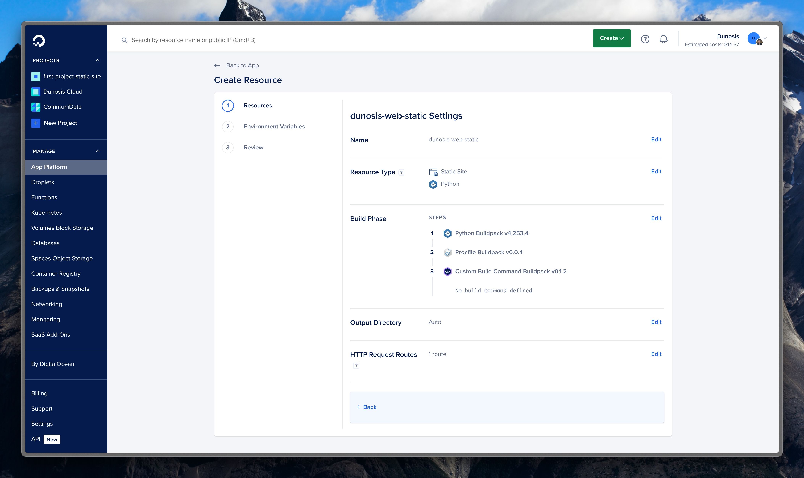
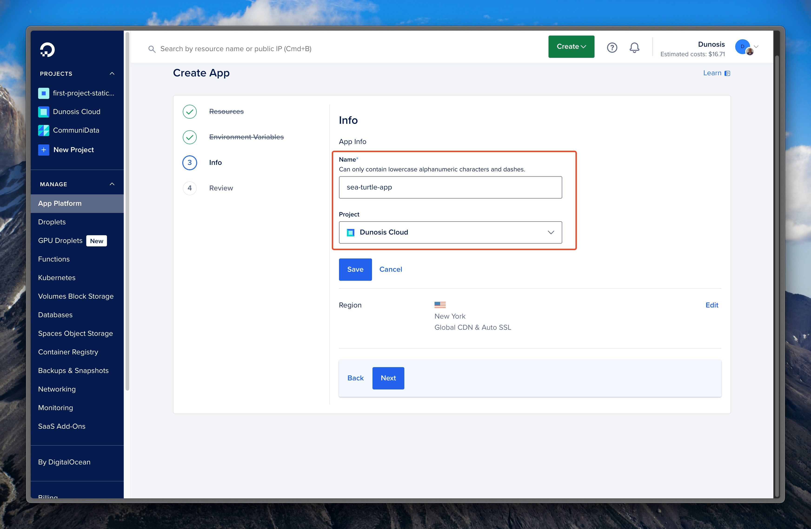
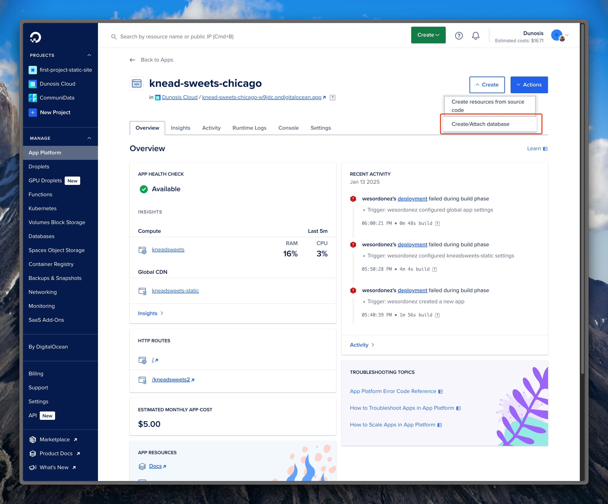
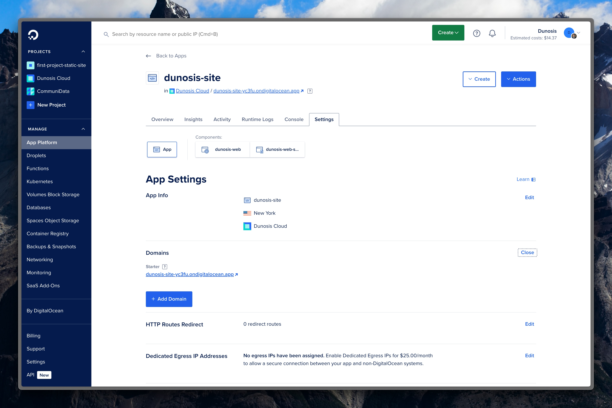
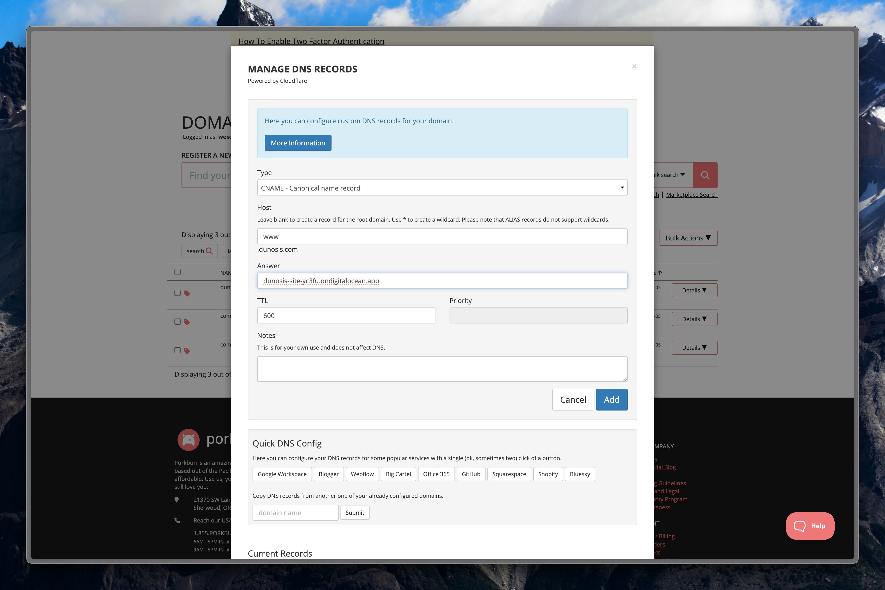

# Deployments on Digital Ocean App Platform

!!! warning ":construction: Under Construction :construction:"

    This section is still under construction. Facts, information, and data in here may not be complete or accurate yet. 

This is a guide on how to create a new App Platform deployment on DigitalOcean. A fully deployed django app with custom domain will be the end result of this guide by following these steps: 

## Prerequisites

For this to work, you need to have used the web dev template and have a working django project on the the main branch of the desired repo. Additionally, that repo needs to have permissions configured to allow DigitalOcean to access and pull the branch. 

## Part 1: Deploying a Web Service
## 1. Create a New App Resource

Click on Create > App

## 2. Select the Repo to Deploy

Click on GitHub provider and find and select the desired repo from the drop down menu.

## 3. Edit the App Resources

Click Edit and change the amount of resources needed by the app in order to reduce costs during development.

!!! note
    Resources can always be changed later depending on needs of the project and website.

## 4. Add Environemnt Variables

Using existing projects or `.env` file, create and define the environment variables for the project. Keep in mind, not all variables will be available at this stage yet so they can be left blank. The initial deployments will surely fail, but that will be fixed shortly. 

!!! tip "Pro Tip"
    Use the "Bulk Editor" to make the process much quicker and easier.

## 5. Edit App Info

Change the display name of the app and move to Dunosis Cloud group for better organization and consistency.

## 6. Review and Create Resources

Review the price which should be $5.00 and click Create Resources. 

This concludes part one of the deployment process. By this stage, you should have created a new app resource that automatically pulls new repo changes on the main branch and deploys them. 

## Part 2: Deploying a Static Site
## 1. Create a New Resource from Source Code

Click on Create>New Resource from Source Code

## 2. Edit Resource

1. Change the name of the app to be the same as the resource name with "-static" suffix. (e.g. new-project-static)
2. Change the resource type to Static Site which will act as a CDN to serve the static files to the main deployment.
3. Change the output directory to `/staticfiles`

## 3. Review and Create

Ensure the newly created resource is free ($0.00) and click Create. 

This concludes part 2 of the deployment progress. By this stage, in the app overview you should have two components. Again, the deployments will likely be failing by this stage and that's normal. 

## Part 3: Creating and Attaching a Database
## 1. Create a New Database in the Postgres Cluster

Navigate to the Dunosis Postgres Cluster and add a new database with the same name as the resource with a "-db" suffix. (e.g. new-project-db)

## 2. Attach Database to App

In the app overview, click on Create>Create/Attach existing database. Select the database and click create. 

This concludes part 3 of the deployment process. By this stage you should have a deployed app with 3 components: web service, static site, and database. At this point, it's likely that the deployments have been unsuccessful. Next, we will focus on troublshooting and finalizing the deployment.

## Part 4: Adding a Domain and Finalizing Deployment

!!! note 
    This section assumes you already have a domain. For more info on purchasing or transfering a domain see this guide.

## 1. Add a Domain to the App Settings in Digital Ocean

Navigate to the App Settings and click on Add Domain

## 2. Configure Domain

 1. Add domain or subdomain name
 2. Select "You manage your domain" option
 3. Copy CNAME Alias and add to CNAME record "answer" in Porkbun
 4. Go back to Digital Ocean and click "Add Domain"

## 3. Test New Domain

Once project finishes deploying test the new domain. 

SUCCESS! This concludes the new domain section! By this stage, you should have a fully deployed app on a custom domain name in Digital Ocean!
