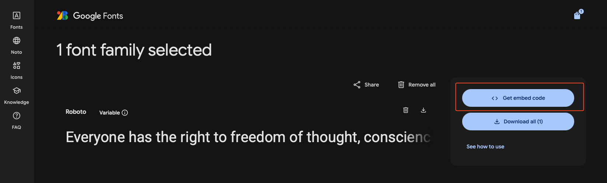
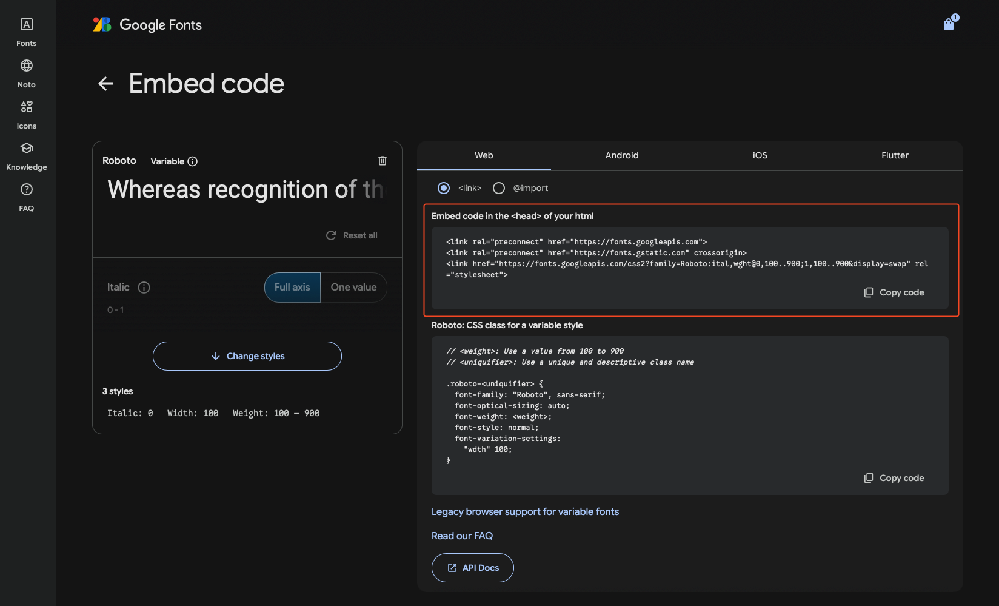

# How to Add Custom Fonts to a New Django Web Dev Project

This guide covers how to add custom fonts to a Django-based web development project. We’ll look at a few different methods, with examples and notes based on best practices at Dunosis.

---

## Method 1: Google Fonts (Easiest!)

The easiest way to add fonts is to use the **free Google Fonts CDN**.

Go to **[Google Fonts](https://fonts.google.com/)** and select one or more fonts you'd like to use. Once selected, Google will generate a snippet of code for you to embed.

📸 Example from Google Fonts:  



### ✅ Steps:

1. Copy the `<link>` tag from the Google Fonts sidebar.

2. Paste it into the `<head>` of your base HTML template file:

    ```html
    <!-- base.html or main.html -->
    <head>
        ...
        <link rel="preconnect" href="https://fonts.googleapis.com">
        <link rel="preconnect" href="https://fonts.gstatic.com" crossorigin>
        <link href="https://fonts.googleapis.com/css2?family=Roboto:ital,wght@0,100..900;1,100..900&display=swap" rel="stylesheet">
        ...
    </head>
    ```

3. Then reference it in your CSS:

    ```css
    body {
        font-family: "Inter", sans-serif;
    }
    ```
    Or define a new class for that specific font:

    ```css
    .new-font-name {
        font-family: "Inter", sans-serif;
    }
    ```

!!! note
    If fonts don’t show up, try **restarting your development server** and doing a **hard refresh** in the browser:

    - Chrome: Hold `Shift` and click the Reload button  
    - Mac: `Cmd + Shift + R`

---

## Method 2: Using Local Custom Font Files

If your desired fonts aren't available via Google Fonts, you can host and use **custom font files** directly.

### 1. Download & Manage Font Files

Fonts often come in several file formats for compatibility:

- `.ttf` (TrueType Font)  
- `.woff` / `.woff2` (Web Open Font Format)  
- `.svg` (Scalable Vector Graphics Font)  
- `.otf` (OpenType Font)  
- `.pfa` / `.pfb` (PostScript Fonts)  
- `.dfont` (Mac OS X Data Fork Font)  
- `.bdf` / `.pcf` (Bitmap Distribution Format / Portable Compiled Format)  
- `.ps` (Type 1 PostScript Fonts)  
- `.webfont` (Generic Web Font Format)

!!! tip
    It's also a good idea to install the fonts on your local machine for use in apps like Figma, Photoshop, etc.

!!! warning "Be Mindful of Licensing"
    Only use fonts with open or commercial-use licenses. Many custom fonts require purchasing or permission for use in web projects.

---

### 2. Add Fonts to Your Project Directory

Organize font files under your static or template directory, like this:

```plaintext
📂 Project_Repo
├── templates
│   ├── assets
│   │   ├── fonts
│   │   ├── images
│   │   ├── json
│   │   ├── logos
│   ├── html
│   ├── css
│   ├── js
```

---

### 3. Reference Fonts in Your CSS

In your CSS file (e.g., `index.css`, `styles.css`), declare the font using `@font-face`:

```css
@font-face {
    font-family: "Noir Pro";
    src: url("../fonts/NoirPro-Regular.eot");
    src: url("../fonts/NoirPro-Regular.eot?#iefix") format("embedded-opentype"),
         url("../fonts/NoirPro-Regular.woff2") format("woff2"),
         url("../fonts/NoirPro-Regular.woff") format("woff"),
         url("../fonts/NoirPro-Regular.ttf") format("truetype");
    font-weight: normal;
    font-style: normal;
}
```

Then use it like any other font:

```css
body {
    font-family: "Noir Pro", sans-serif;
}
```

---

### 4. (Optional) Add Font to Tailwind Config

If you’re using **TailwindCSS**, you can define your custom font in the `tailwind.config.js`:

```js
// tailwind.config.js
theme: {
  extend: {
    fontFamily: {
      custom-font-name: ["Noir Pro", "sans-serif"],
    },
    colors: {
      "bg-primary": "#f5f5f5",
      "du-red": "#C62A2C",
      "du-green": "#029A4D",
      "du-blue": "#4D40f0",
      "du-yellow": "#ECB731",
      "du-purple": "#68008A",
    },
  },
},
```

!!! info "Tailwind Version Notes"
    This guide assumes usage of TailwindCSS 3.x. Tailwind 4.0 introduces major changes in config and file structure.  
    Dunosis templates are currently based on v3 but are in the process of migrating. Updates will be reflected in future documentation.

You can now use the custom font in your HTML:

```html
<p class="font-custom-font-name">Hello World</p>
```

---

## 📚 Resources

- [Google Fonts](https://fonts.google.com/)
- [Font Squirrel (Free fonts)](https://www.fontsquirrel.com/)
- [TailwindCSS Docs](https://tailwindcss.com/docs/font-family)
- [AI Font Pairing](https://fontjoy.com)
- [Collaborative Digital Type Foundry](http://www.losttype.com/)
- [Icons as Fonts](https://fontawesome.com/v5/cheatsheet)
- [Archive of Free Fonts](https://www.dafont.com/)

---
